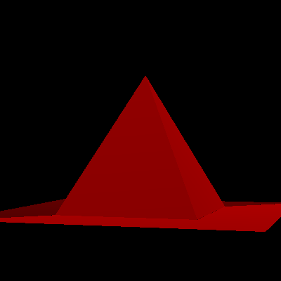

# Lovetrace

## Description

Lovetrace is a path tracing program developped in Ada.
For now, the only goal that I have with this program is to manage the rendering
of scenes with multiple objects and with light reflexion. For now, everything
is done on the CPU.

|   |
| :----------------------------: |
| _Visual as of the 28/10_       |

## Changelog

### 28/10

As of now, the first version of the program is done. It can render basic
structures with less than 10 vertices (a problem with the octree).
Features are :
- A camera that can move in the (X, Y, Z) space and turn around the x and z axis.
- A basic gestion of light using the [Lambertian Model](https://en.wikipedia.org/wiki/Lambertian_reflectance).

